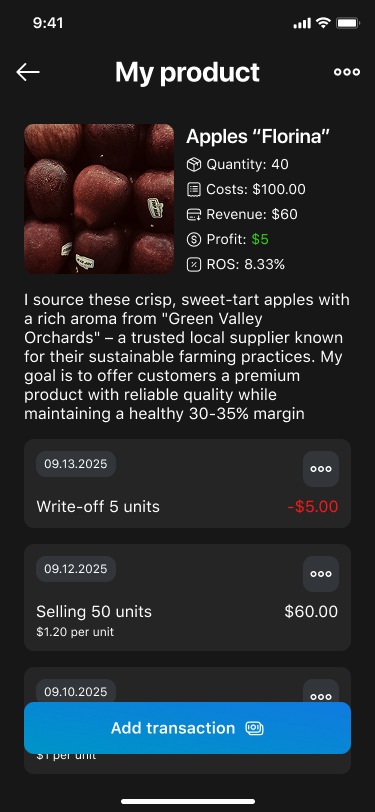
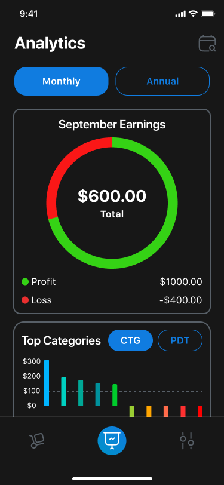
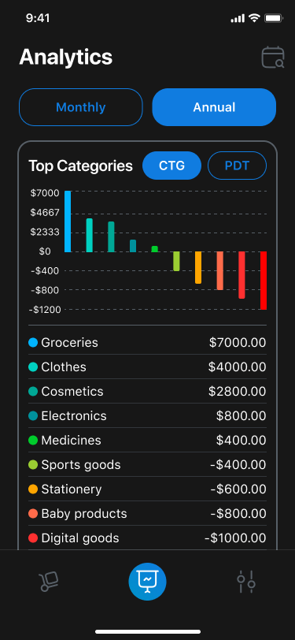

# Lucrum: Profit Made Clear

**Lucrum** is a Flutter app for entrepreneurs and product managers to track their profits, write-offs, and category-based performance — all with visual clarity.


## 🛠️ Technologies

- **Flutter** and **Dart**
- **Provider** — state management
- **Hive** — local storage for transactions and product data
- **Charts** — circular and bar charts for visual analytics
- **Custom UI** — profit/loss markup, transaction logs, category filters

## 📱 Screenshots

| Product Tracking | Monthly Analytics | Annual Analytics |
|------------------|-------------------|------------------|
|  |  |  |

## 🚀 How to Run

1. Clone the repo
   ```sh
   git clone https://github.com/NMMustafina/lucrum_profit_made_clear.git
   ```
2. Install all the packages by typing the following command
   ```sh
   flutter pub get
   ```
3. Run the App
